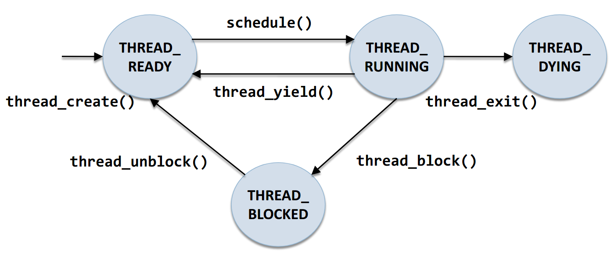
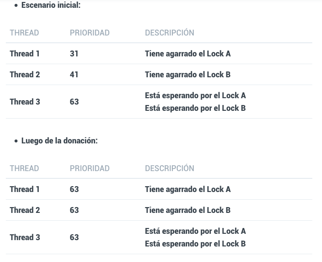

## Fase #1 - Threads

[Home](https://magmarx.github.io/Pintos-master/)

Dentro de esta fase tuvimos que extender sobre la implementación de threads que nos dieron dentro del codigo de base de Pintos

Dentro del codigo base tenemos una estructura para los threads proporcionada por pintos, esta se encuentra dentro del archivo **thread.h**

```c
thread.h
struct thread 
{
 tid_t tid;                          /* El id del thread este nos sirve como identificador unico. */
 enum thread_status status;          /* El estado del thread. */
 char name[16];                      /* Nombre del thread (se usa para debbuggear) */
 uint8_t *stack;                     /* El puntero del stack del thread. */
 int priority;                       /* La prioridad del thread. */
 struct list_elem allelem;           /* Listado de elementos del thread. */

 /* Estas propiedades estan compartidas entre thread.c y synch.c. */
 struct list_elem elem;              /* Listado de los elementos que tiene el thread. */
}
```

Dentro de thread.h tambien vienen unas funciones por defecto las cuales son:

```c
thread.h

void thread_init (void); /* Inicializa las estructuras globales que todos los threads utilizan, como locks o semáforos. */
tid_t thread_create (const char *name, int priority, thread_func *, void *); /*Crea un nuevo thread y lo coloca en un ready state.*/
void thread_block (void); /* Bloquea al thread actual en ejecución */
void thread_unblock (struct thread *); /* Toma al thread que se pasa como argumento y lo desbloquea. */
struct thread *thread_current (void); /* Retorna un puntero al thread actual en ejecución. */
void thread_foreach (thread_action_func *, void *); /* Toma la función pasada como argumento y la aplica sobre cada thread. */
int thread_get_priority (void); /* Retorna la prioridad del thread actual en ejecución (Implementada en la  Priority Scheduling). */
void thread_set_priority (int); /* Toma el entero pasado como argumento, y cambia la prioridad del thread actual en ejecución al valor de este entero. (Implementada en la  Priority Scheduling). */

```

La linea de ejecución de los threads dentor de pintos es la siguiente:



Esta fase se divide en 3 partes

## Alarm Clock
En la carpeta **src/threads/** los siguientes archivos son necesarios para modificar el **Alarm Clock**:
```c
thread.c
thread.h
```

### Problema inicial
Inicialmente el método **timer_sleep** tiene la siguiente implementación.
```c
void
timer_sleep (int64_t ticks) 
{
  int64_t start = timer_ticks ();

  ASSERT (intr_get_level () == INTR_ON);
  while (timer_elapsed (start) < ticks) 
    thread_yield ();
}
```
Está implementación se conoce como **"busy waiting"**, en está implementación se revisa si el hilo debe estar durmiendo, al estarlo le da su lugar a otro hilo, **thread_yield()**, por lo tanto se calanderiza un nuevo hilo al procesador.

## Métodos agregados en Alarm Clock
En la siguiente imagen fueron agregados 2 métodos en el archivo:
~~~
thread.c
~~~

```c
void agregarListaHilosEspera(int64_t ticks){
  /*interrup.c, necesario para deshabilitar interrupciones*/
  enum intr_level antiguoNivel;

  /* Archivo threads/interrupt.c Disables interrupts and returns the previous interrupt status. */
  antiguoNivel = intr_disable();

  //retorna un puntero al hilo actual
  struct thread *hiloActual = thread_current();

  /* remueva el thread que se enuentra en estado ready list del struct
    list threadsEsperando. Realiza un cambio de estado, a thread blocked
  */

  //timer_ticks() Returns the number of timer ticks since the OS booted.
  // tiempoThreadDormido de thread.h
  hiloActual->tiempoThreadDormido = timer_ticks()+ticks;

  list_push_back(&threadsEsperando,&hiloActual->elem);

  // bloquea al thread actual en ejecucion
  thread_block();

  // habilitar interrupciones
  intr_set_level(antiguoNivel);
}
```


```c
/*
cuando sucede un timer_intept, si el tiempo del hilo ha terminado, se mueve de regreso a ready_list
con la funcion thread_unblock
*/

void eliminarHiloDormido(int64_t ticks){

  struct list_elem *iteracion = list_begin(&threadsEsperando);

  while(iteracion != list_end(&threadsEsperando)){
    struct thread *threadsListaEsperando = list_entry(iteracion,struct thread,elem);

    if (ticks>=threadsListaEsperando->tiempoThreadDormido)
    {
      /* code */
      // quitarlo de lista espera, regresarlo a ready_list
      iteracion=list_remove(iteracion);
      thread_unblock(threadsListaEsperando);
    }else{
      iteracion = list_next(iteracion);
    }
  }
}
```

En el archivo 
~~~
thread.h
~~~
Se agregaron los mismos métodos como prototipos. **Esto es para indicar que son métodos que se tienen que implementar.**

```c
/* Prototipo necesario para reimplementar el metodo timer_sleep del archivo timer.c
  para solucionar el busy waiting inicial
  agregarListaHilosEspera(ticks), lo que hace es bloquear al hilo actual, insertarlo en una lista 
  de hilos en espera de cumplir el tiempo que deben estar dormidos.
*/
void agregarListaHilosEspera(int64_t ticks);

/*prototipo que desbloquea los hilos que estan durmiendo luego de cierto tiempo. Implementacion en thread.c*/
void eliminarHiloDormido(int64_t numeroTicks);

```

## ¿Donde mandamos a llamar los métodos implementados?
Asumiendo que estamos dentro de nuestra carpeta principal llamada **Pintos-master**, en la carpeta  **devices**. El nombre del archivo a modificar es:
~~~
timer.c
~~~

El archivo **timer.c** allí se mandan a llamar los métodos implementados para eliminar el **busy waiting**


## ¿Qué encontramos en la carpeta devices?
Código fuente para la interfaz del dispositivo de E / S: teclado, temporizador, disco, etc. **Se utiliza para la implementación del temporizador en el proyecto 1.**

**En el archivo timer.h, el temporizador del sistema que marca, de forma predeterminada, 100**

En el método **timer_sleep**
```c
/* Sleeps for approximately TICKS timer ticks.  Interrupts must
   be turned on. */
void
timer_sleep (int64_t ticks) 
{
  /*CODIGO original realiza busy waiting: 
  int64_t start = timer_ticks ();
  ASSERT (intr_get_level () == INTR_ON);
  while (timer_elapsed (start) < ticks) 
    thread_yield ();*/
  ASSERT (intr_get_level () == INTR_ON);
  agregarListaHilosEspera(ticks);
}
```

En el método **timer_interrupt**
```c
/* Timer interrupt handler. 
  timer_interrupt es el reloj de pintos. Al ser invocado la 
*/
static void
timer_interrupt (struct intr_frame *args UNUSED)
{
  ticks++;
  thread_tick ();

  // desbloque los hilos luego de cumplirse su tiempo
  eliminarHiloDormido(ticks);
}
```


**Recomendaciones para no alterar los resultados del autograder**
El argumento de timer_sleep () se expresa en tics del temporizador, no en milisegundos ni en ninguna otra unidad. Hay tics del temporizador TIMER_FREQ por segundo, donde **TIMER_FREQ es una macro definida en devices / timer.h.** El valor predeterminado es 100. **No es recomendable cambiar este valor, ya que es probable que cualquier cambio provoque la falla de muchas de las pruebas.**


### Priority Scheduling 

Dentro de esta fase tuvimos que implementar el calendarizador de tareas dentro de pintos para poder ordenar la prioridad con la que se ejecutan los diferentes threads.

Sabemos que Pintos cuenta con una calendarizacion ya implementada dentro de su codigo base la cual se basa en Round-Robin, El cual le asigna a cada thread un tiempo denominado quantum que es equivalente a 4 ticks por default cabe resaltar que en este metodo no existen  prioridades y que todos  los threads son tratados de forma  equitativa.

Trabajamos dentro de 4 archivos principalmente, estos se encuentran sobre pintos-master/src/threads/:

~~~
* thread.h
* thread.c
* synch.h
* synch.c
~~~

#### Casos de donación

##### Multiple Donations
##### Synch.h
En este archivo vamos a implementar lo que son las propiedades para el lock


```c
   synch.h
   
   struct lock {
    int priority_lock; 
    struct list_elem list_element_lock 
    }
```

luego agregamos una estructura nueva para la funcion de check_lock_priority la cual nos ayudara a poder comparar la prioridad entre locks.

```c
   synch.h
   
   static bool check_lock_priority (struct list_elem *, struct list_elem *, void *);
```
##### Synch.c

En este archivo vamos a implementar lo que biene siéndo el encargado de administrar la logica de cuando es necesario donar prioridad


```c
   synch.c
   void lock_init (struct lock *lock) {
    ASSERT (lock != NULL);
    
    lock->holder = NULL;
    sema_init (&lock->semaphore, 1);
     
    lock->priority_lock = FAKE_PRIORITY;
    }
```
vamos a inicializar la prioridad de nuestro lock como -1
```c
   synch.c
  void lock_acquire (struct lock *lock) {	
	ASSERT (lock != NULL);	
	ASSERT (!intr_context ());	
	ASSERT (!lock_held_by_current_thread (lock));

    struct thread *cur;
	struct thread *lock_holder;
	struct lock *lock_next;
	int lock_iter;


	enum intr_level old_level;
	old_level = intr_disable();
	cur = thread_current();
	lock_holder = lock->holder;
	lock_next = lock;
	lock_iter = 0;
}
```
En esta funcion vamos a obtener el tread que tiene el lock actual, donde el cur y lock_holder deben ser los mismos y obtenemos el lock.

```c
   synch.c
  void lock_acquire (struct lock *lock) {	
	ASSERT (lock != NULL);	
	ASSERT (!intr_context ());	
	ASSERT (!lock_held_by_current_thread (lock));

    struct thread *cur;
	struct thread *lock_holder;
	struct lock *lock_next;
	int lock_iter;


	enum intr_level old_level;
	old_level = intr_disable();
	cur = thread_current();
	lock_holder = lock->holder;
	lock_next = lock;
	lock_iter = 0;
}
```


En el caso que el lock ya tenga un lock asignado vamos a decirle a nuestro thread actual que lock debemos de obtener cuando se desocupe.

```c
   synch.c
   	if(lock_holder !=NULL)
	{
        /* 
        En el caso que el lock ya tenga un lock asignado
        vamos a decirle a nuestro thread actual el lock
        que va a pedir cuando se desocupe.
        */
	  cur->lock_blocked_by = lock;
	}
  
```

En el caso de que se encuentre un thread en el lock y la prioridad del thread que se encuentra actualmente en el lock sea menor a la prioridad del thread que se encuentra en espera. debemos de llamar a la funcion set_thread_priority que se encuentra en el archivo thread.c la cual veremos a detalle mas adelante.

Priority_lock es la priodirdad mas alta en su lista. En el caso de que el nuevo thread tenga una prioridad mayor el que viene despues en la fila el que se encuentra en el lock_next vamos a donarle la prioridad de nuestro thread actual al siguiente en la fila 

```c
   synch.c
   	while (!thread_mlfqs && lock_holder != NULL &&
	       lock_holder->priority < cur->priority)
	  {
	    set_thread_priority (lock_holder, cur->priority, true);
  
	    if (lock_next->priority_lock < cur->priority)
	      {
	        lock_next->priority_lock = cur->priority;
	      }
	  }
   
   sema_down (&lock->semaphore);
	  lock->holder = cur;
  
```
En el caso de que haya terminado el thread en el lock actual lo que vamos hacer es poner el siguiente thread dentro del lock y vamos a reordenar la lista de los threads que estan esperando

```c
   synch.c
   	if (!thread_mlfqs)
	  {
	    cur->lock_blocked_by = NULL;
	    list_insert_ordered (&cur->locks, &lock->list_element_lock,
	                         check_lock_priority, NULL);
	  }
	  intr_set_level (old_level);
  
```

obtenemos el thread actual y guardamos la prioridad del thread actual dejando vacio el holder del lock y le avisamos al semaforo que ya se libero un espacio luego eliminamos los valores que tenga el lock y colocamos su prioridad como -1. Si el thread actual no tiene ningun lock

```c
   synch.c
   void lock_release (struct lock *lock) {
    ASSERT (lock != NULL);
    ASSERT (lock_held_by_current_thread (lock));

    struct thread *curr_thread;
    curr_thread = thread_current();
  
    enum intr_level old_level;
    old_level = intr_disable();
    
libero un espacio
    lock->holder = NULL;
    sema_up (&lock->semaphore);

    list_remove(&lock->list_element_lock);
    lock->priority_lock = FAKE_PRIORITY;

    if (list_empty(&curr_thread->locks)) {
        curr_thread->is_donated = false;
        thread_set_priority(curr_thread->old_priority);
    }
}
  
```

Editamos la función de thread_set_priority para que llame a una función custom que creamos para que esta administre todas las reglas de donación
```c
void thread_set_priority (int new_priority) {
	struct thread *curr_thread = thread_current ();	
	  /* 
	  Vamos a llamar a la nueva funcion que creamos para realizar
	  el nuevo set de prioridades tomando en cuenta los metodos de donacion
	  */
	set_thread_priority(curr_thread, new_priority, false);
}

void set_thread_priority (struct thread *curr_thread, int new_prior, bool is_donated) {

  enum intr_level old_level = intr_disable();

  /* 
  Primero vamos a verificar que la prioridad
  del thread este dentro de nuestro minimo de 0
  y maximo de 63

  Y verificamos que el thread activo sea un thread
  */
  ASSERT (new_prior >= PRI_MIN && new_prior <= PRI_MAX);
  ASSERT (is_thread (curr_thread));

   /* 
   *  
   if this operation is a not donatation
    *   if the thread has been donated and the new priority is less 
    *   or equal to the donated priority, we should delay the process
    *   by preserve it in priority_original.
    * otherwise, just do the donation, set priority to the donated
    * priority, and mark the thread as a donated one.
    */ 
   if (!is_donated) {
     /* Este es el caso en el que no sea una donacion */
       if (curr_thread->is_donated && new_prior <= curr_thread->priority) {
         /* 
         En el caso de que al thread ya le hayan donado antes una prioridad 
         y que la nueva prioridad sea menor o igual a la prioridad anterior
         que tenia el thread, vamos a guardar la nueva prioridad en la 
         propiedad de old_priority
         */
          // Here we delay the process so we can preserve it's original priority
          curr_thread->old_priority = new_prior; 
        } else {
          /* 
          * En el caso contrario vamos a setear la nueva prioridad que se nos envio
          */
          curr_thread->priority = new_prior;
          curr_thread->old_priority = new_prior;
        }
    } else {
       /*
       * Here we do the priority donation and
       * mark the thread as a donating one.
       */

       /*
       Ahora en el caso de que si sea una donacion
       vamos a setear la nueva prioridad y vamos a 
       colocar la variable de is_donated como true
       */
        curr_thread->priority = new_prior;
        curr_thread->is_donated = true;
    }

    if (curr_thread->status == THREAD_READY) {
      /*
      * If the thread finished it's process
      * then we just move it to the ready_list
      * to keep the list in order
      */

      /*
        En el caso de que nuestro thread ya haya terminado
        con su proceso solo vamos a mover el thread a la lista
        de ready_list para mantener todo ordenado
      */
      list_remove(&curr_thread->elem);
      list_insert_ordered(&ready_list, &curr_thread->elem, compare_priority, NULL);
    } else if ((list_entry(list_begin(&ready_list), struct thread, elem)->priority > curr_thread->priority) && curr_thread->status == THREAD_READY) {
      /*
      * If the thread with the highest priority in the list it's
      * larger than the current thread priority then we make the
      * current thread yield the cpu to the other thread
      */

      /*
      En el caso que el thread que tenga la mayor prioridad de la lista
      de espera tenga una mayor prioridad que el thread activo entonces 
      vamos a hacer que el thread activo ceda el procesador al nuevo thread.
      */
      thread_yield_current(curr_thread);
    }

  intr_set_level (old_level);
}

```

Tambien creamos algunas funciones dentro de thread.c
1. compare_priority: Esta funcion nos va a ayudar a comparar la prioridad entre dos threads
2. thread_yield_current: Esta funcion nos va a permitir hacerle yield (ceder) al thread que esta activo actualmente

```c
bool compare_priority(struct list_elem *first_thread,struct list_elem *second_thread,void *AUX UNUSED){
	struct thread *thread_1=list_entry(first_thread,struct thread,elem);
	struct thread *thread_2=list_entry(second_thread,struct thread,elem);
	return thread_1->priority>thread_2->priority;
}

void thread_yield_current (struct thread *curr_thread) {
	ASSERT (is_thread (curr_thread));
	enum intr_level old_level;
	
	ASSERT (!intr_context ());
	
	old_level = intr_disable ();
	if (curr_thread != idle_thread) {
	    /*
	    * Make sure that the ready_list is ordered so the thread
	    * with the highest priority run's first
	    */
	  list_insert_ordered(&ready_list, &curr_thread->elem, compare_priority, NULL);
	}
}
```

##### Nested Donation & Dontaion Chain

Este es un escenario de donación en donde si un thread esta esperando al mismo lock que tienen n threads al puede donarles su prioridad para ver cual se libera primero y el poder tomar el siguiente lock. 

Algo importante que tenemos que tener en cuenta aqui es que al ser una donación recursiva esta podria crecer demasiado por lo que debemos de controlar el nivel maximo de donaciones que podemos hacer, pintos recomienda 8.



Tambien dentro de esta sección implementamos el test de donation chains el cual consiste en la propagación de donaciones por medio de un numero arbitrario de niveles para el nested donations.

*Cambios*

~~~
synch.c
~~~
Creamos la funcion de sema_compare, la utlizamos para poder comparar semaforos.
```c
bool	sema_compare ( struct list_elem *a_, struct list_elem *b_,	void *aux UNUSED)	{	
		ASSERT (a_ != NULL);	
		ASSERT (b_ != NULL);	
			
		struct semaphore_elem *a = list_entry (a_, struct semaphore_elem,	elem);	
		struct semaphore_elem *b = list_entry (b_, struct semaphore_elem,	elem);	
			
		return (a->priority_sema > b->priority_sema);		
}
```
Tambien editamos algunas funciones que venian dentro del codigo base de pintos (lock_acquire, cond_wait)
~~~
Base Code After Multiple Donations edit synch.c
~~~
```c
void	lock_acquire (struct lock *lock)	{	
	  ASSERT (lock != NULL);	
	  ASSERT (!intr_context ());	
	  ASSERT (!lock_held_by_current_thread (lock));	
		
	  struct thread *cur;	
	  struct thread *lock_holder;	
	  struct lock *lock_next;	
	  int lock_iter;	
		
		
	  enum intr_level old_level;	
	  old_level = intr_disable();	
	  cur = thread_current();	
	  lock_holder = lock->holder;	
	  lock_next = lock;	
	  lock_iter = 0;	
		
	  if(lock_holder !=NULL)	
	  {	
	    cur->lock_blocked_by = lock;	
	  }	
		
	  while (!thread_mlfqs && lock_holder != NULL &&	
	         lock_holder->priority < cur->priority)	
	    {	
	      set_thread_priority (lock_holder, cur->priority, true);	
	      /* Priority_lock is the highest priority in its waiters list */	
	      if (lock_next->priority_lock < cur->priority)	
	        {	
	          lock_next->priority_lock = cur->priority;	
	        }	
	    }	
     
	  sema_down (&lock->semaphore);	
	  lock->holder = cur;	
		
	  if (!thread_mlfqs)	
	    {	
	      /* After getting this lock, reset lock_blocked_by and add this lock	
	       * to the locks list	
	       */	
	      cur->lock_blocked_by = NULL;	
	      list_insert_ordered (&cur->locks, &lock->list_element_lock,	
	                           check_lock_priority, NULL);	
	    }	
	  intr_set_level (old_level);	
	}
 
 void	cond_wait (struct condition *cond, struct lock *lock) {	
	  struct semaphore_elem waiter;	
		
	  ASSERT (cond != NULL);	
	  ASSERT (lock != NULL);	
	  ASSERT (!intr_context ());	
	  ASSERT (lock_held_by_current_thread (lock));	
	  	
	  sema_init (&waiter.semaphore, 0);	

	  lock_release (lock);	
	  sema_down (&waiter.semaphore);	
	  lock_acquire (lock);	
	}
```

~~~
Edited synch.c
~~~

*Cambios en lock_acquiere*
1. Agregamos el if que nos permitira agregar la logica para los nested donations, en el cual preguntamos si el lock_holder (el thread que tiene al lock actualmente) esta bloqueado por algun otro thread y no hemos llegado a nuestro limite de niveles para el nested donation
2. Si esto se cumple vamos a colocar el siguiente lock en el que lo esta bloqueando y luego el actual se va a volver el que lo tiene bloqueado
3. Vamos a seguir iterando hasta que se liberen los locks

*Cambios cond_wait*
1. Asignamos una prioridad al semaforo igual a la prioridad del threead actual
2. Ordenamos la lista de semaforos basandonos en la prioridad de cada uno
```c
void lock_acquire (struct lock *lock) {
	  ASSERT (lock != NULL);
	  ASSERT (!intr_context ());
	  ASSERT (!lock_held_by_current_thread (lock));
	
	  struct thread *cur;
	  struct thread *lock_holder;
	  struct lock *lock_next;
	  int lock_iter;
	
	
	  enum intr_level old_level;
	  old_level = intr_disable();
	  cur = thread_current();
	  lock_holder = lock->holder;
	  lock_next = lock;
	  lock_iter = 0;
	
	  if(lock_holder !=NULL)
	  {
	    cur->lock_blocked_by = lock;
	  }
	
	  while (!thread_mlfqs && lock_holder != NULL &&
	         lock_holder->priority < cur->priority)
	    {
	      set_thread_priority (lock_holder, cur->priority, true);
	      /* Priority_lock is the highest priority in its waiters list */
	      if (lock_next->priority_lock < cur->priority) {
	        lock_next->priority_lock = cur->priority;
	      }
	
	     /* Nest donation: find the next lock that locks the current	
		    * lock_holder	
		    */	
		    if (lock_holder->lock_blocked_by != NULL && lock_iter < LEVEL_LOCK)	{	
		      lock_next = lock_holder->lock_blocked_by;	
		      lock_holder = lock_holder->lock_blocked_by->holder;	
		      lock_iter ++;	
		    }	else {
	        break;
	      }
	    }
	
	  sema_down (&lock->semaphore);
	  lock->holder = cur;
	
	  if (!thread_mlfqs)
	    {
	      /* After getting this lock, reset lock_blocked_by and add this lock
	       * to the locks list
	       */
	      cur->lock_blocked_by = NULL;
	      list_insert_ordered (&cur->locks, &lock->list_element_lock,
	                           check_lock_priority, NULL);
	    }
	  intr_set_level (old_level);
	
	}
 
void cond_wait (struct condition *cond, struct lock *lock) {
	  struct semaphore_elem waiter;
	
	  ASSERT (cond != NULL);
	  ASSERT (lock != NULL);
	  ASSERT (!intr_context ());
	  ASSERT (lock_held_by_current_thread (lock));
	  
	  sema_init (&waiter.semaphore, 0);
	  waiter.priority_sema = thread_current()->priority;	
		 list_insert_ordered(&cond->waiters,&waiter.elem,sema_compare,NULL);	
	 	// list_push_back (&cond->waiters, &waiter.elem);
	  lock_release (lock);
	  sema_down (&waiter.semaphore);
	  lock_acquire (lock);
	}
```
Editamos una estructura dentro del codgo base (semaphone_elem)

~~~
Base Code After Multiple Donations edit synch.c
~~~
```c
struct semaphore_elem 
{
	   struct list_elem elem;              /* List element. */
	   struct semaphore semaphore;         /* This semaphore. */
};
```

~~~
Edited synch.c
~~~
```c
struct semaphore_elem 
{
	   struct list_elem elem;              /* List element. */
	   struct semaphore semaphore;         /* This semaphore. */
	   int priority_sema;                  /* Priority Semaphoe*/
};
```

~~~
Cambios en thread.h
~~~
1. Agregamos una variable global para representar la cantidad maxima de iteraciones que se pueden hacer de nested donations (LEVEL_LOCK)
2. Agregamos algunas propiedades adicionales a la estructura de threads (sleep_elem, lock_blocked_by, wakeup_ticks)
3. Creamos una nueva funcion (compare_priority)

```c

#define LEVEL_LOCK 8
	
struct thread {
	/* Owned by thread.c. */
	tid_t tid;                          /* Thread identifier. */
	enum thread_status status;          /* Thread state. */
	char name[16];                      /* Name (for debugging purposes). */
	uint8_t *stack;                     /* Saved stack pointer. */
	int priority;                       /* Priority. */
	struct list_elem allelem;           /* List element for all threads list. */
	
	/* Shared between thread.c and synch.c. */
	struct list_elem elem;              /* List element. */
	
	// Added properties
	struct list_elem sleep_elem;
	struct lock *lock_blocked_by;
	struct list locks;
	bool is_donated;
	int old_priority;
	int64_t wakeup_ticks;    
	//Finished adding props
	
	#ifdef USERPROG
	    /* Owned by userprog/process.c. */
	    uint32_t *pagedir;                  /* Page directory. */
	#endif
	
	/* Owned by thread.c. */
	unsigned magic;                     /* Detects stack overflow. */
};

bool compare_priority(struct list_elem*,struct list_elem*,void*);

```

~~~
Elementos creados para el archivo de thread.c
~~~
Dentro del archivo de thread.c para nested donations creamos multiples funciones:
1. compare_ticks: nos permite comparar ticks dentro de threads
2. thread_priority_temporarily_up: Nos va a permitir incrementar a la prioridad maxima de un thread
3. thread_priority_restore: Va a retornar la prioridad de un thread a su prioridad original
4. block_thread_until: Nos va a permitir dormir un thread por una cantidad de ticks que recibimos como parametro
6. thread_set_next_wakeup: Despertamos al siguiente threead con mayor prioridad dentro de la lista de threads dormidos

```c
	/*Compare wakeup ticks*/
	bool
	compare_ticks(struct list_elem *a,struct list_elem *b,void *AUX UNUSED)
	{
	  struct thread *t1 = list_entry(a,struct thread,elem);
	  struct thread *t2 = list_entry(b,struct thread,elem);
	  return t1->wakeup_ticks<t2->wakeup_ticks;
	}
	
	/*Set new temporal priority*/
	void
	thread_priority_temporarily_up(void)
	{
	  struct thread *cur = thread_current();
	  cur->old_priority = cur->priority;
	  cur->priority = 63;
	  return;
	}
	
	/*Restore to old_priority*/
	void
	thread_priority_restore(void)
	{
	  struct thread *cur = thread_current();
	  cur->priority = cur->old_priority;
	  return;
	}
	
	/* Block thread unitl wakeup time is 0 */
	void block_thread_until(int64_t wakeup)
	{
	  enum intr_level old_level;
	  struct thread *cur = thread_current();
	  if(wakeup<=0)
	  {
	    return;
	  }
	  ASSERT(cur->status == THREAD_RUNNING);
	  cur->wakeup_ticks = wakeup;
	  old_level = intr_disable();
	   list_insert_ordered(&sleep_list,&cur->elem,compare_ticks,NULL);
	   thread_block();
	  intr_set_level(old_level);
	}
	
	/* We unblock the next thread in the sleeping thread list */
	void thread_set_next_wakeup(void)
	{
	  enum intr_level old_level;
	  if(list_empty(&sleep_list))
	    return;
	  struct list_elem *elem_cur;
	  struct thread *t;
	  
	  elem_cur = list_begin(&sleep_list);
	  t = list_entry(elem_cur,struct thread,elem);
	  if(t->wakeup_ticks>timer_ticks())
	    return;
	  old_level = intr_disable();
	  list_remove(elem_cur);
	  thread_unblock(t);
	  intr_set_level(old_level);
	}
	
```

~~~
Ediciones sobre thread.c
~~~
1. inicializamos la lista de threads dormidos dentro de *thread_init* con ```c list_init (&sleep_list); ```
2. Dentro de *thread_tick* llamamos a la funcion thread_set_next_wakeup();
3. Dentro de *thread_create* agregamos un if para que el current_threead ceda el procesador si el nuevo thread tiene mayor prioridad

```c
/* Yield immediately if the newly created thread has a higher priority. */
if(t->priority > thread_current()->priority) {
	thread_yield_current(thread_current());
}
```


### Advanced Scheduling
Por el momento no hemos implementado nada para Advanced scheduling ya que son puntos extras pero si tenemos pensado ver si podemos implementarlo mas adelante
