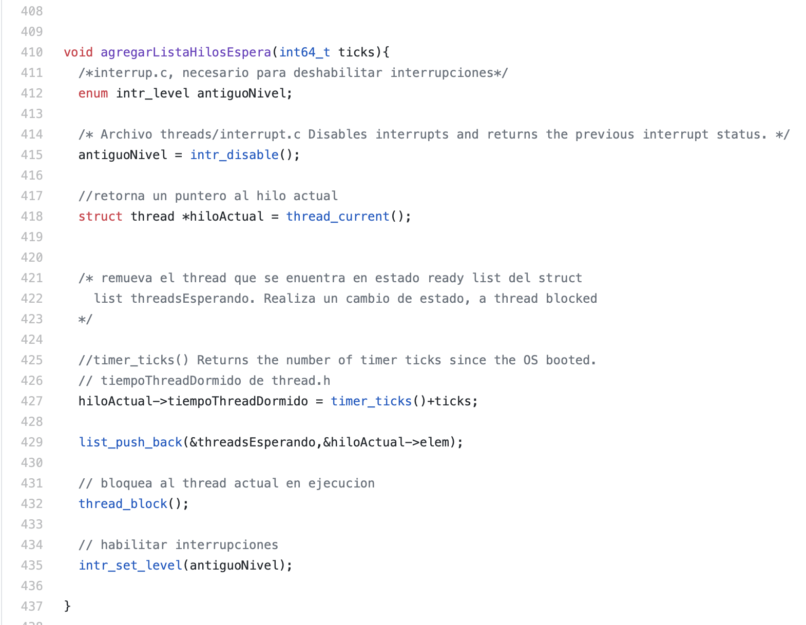
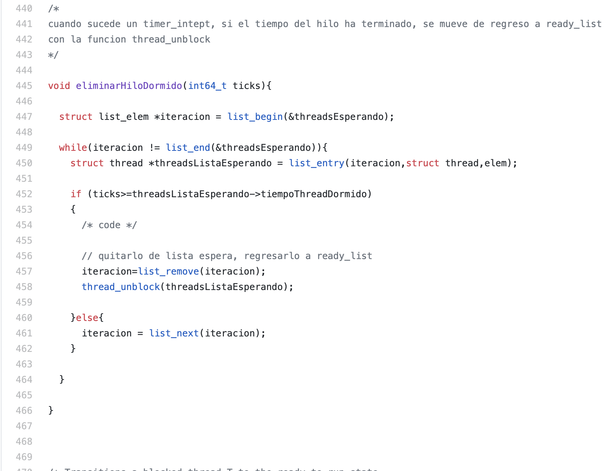
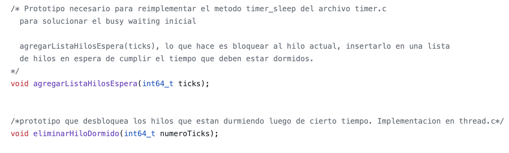

## Fase #1 - Threads

Dentro de esta fase tuvimos que extender sobre la implementación de threads que nos dieron dentro del codigo de base de Pintos

Dentro del codigo base tenemos una estructura para los threads proporcionada opr pintos, esta se encuentra dentro del archivo thread.h

~~~
thread.h
struct thread 
{
 tid_t tid;                          /* El id del thread este nos sirve como identificador unico. */
 enum thread_status status;          /* El estado del thread. */
 char name[16];                      /* Nombre del thread (se usa para debbuggear) */
 uint8_t *stack;                     /* El puntero del stack del thread. */
 int priority;                       /* La prioridad del thread. */
 struct list_elem allelem;           /* Listado de elementos del thread. */

 /* Estas propiedades estan compartidas entre thread.c y synch.c. */
 struct list_elem elem;              /* Listado de los elementos que tiene el thread. */
}
~~~

Dentro de thread.h tambien vienen unas funciones por defecto las cuales son:

~~~
thread.h

void thread_init (void); /* Inicializa las estructuras globales que todos los threads utilizan, como locks o semáforos. */
tid_t thread_create (const char *name, int priority, thread_func *, void *); /*Crea un nuevo thread y lo coloca en un ready state.*/
void thread_block (void); /* Bloquea al thread actual en ejecución */
void thread_unblock (struct thread *); /* Toma al thread que se pasa como argumento y lo desbloquea. */
struct thread *thread_current (void); /* Retorna un puntero al thread actual en ejecución. */
void thread_foreach (thread_action_func *, void *); /* Toma la función pasada como argumento y la aplica sobre cada thread. */
int thread_get_priority (void); /* Retorna la prioridad del thread actual en ejecución (Implementada en la  Priority Scheduling). */
void thread_set_priority (int); /* Toma el entero pasado como argumento, y cambia la prioridad del thread actual en ejecución al valor de este entero. (Implementada en la  Priority Scheduling). */

~~~

La linea de ejecución de los threads dentor de pintos es la siguiente:

Esta fase se divide en 3 partes

## Alarm Clock
En la carpeta **src/threads/** los siguientes archivos son necesarios para modificar el **Alarm Clock**:
~~~
thread.c
thread.h
~~~

### Problema inicial
Inicialmente el método **timer_sleep** tiene la siguiente implementación.
~~~
void
timer_sleep (int64_t ticks) 
{
  int64_t start = timer_ticks ();

  ASSERT (intr_get_level () == INTR_ON);
  while (timer_elapsed (start) < ticks) 
    thread_yield ();
}
~~~
Está implementación se conoce como **"busy waiting"**, en está implementación se revisa si el hilo debe estar durmiendo, al estarlo le da su lugar a otro hilo, **thread_yield()**, por lo tanto se calanderiza un nuevo hilo al procesador.

## Métodos agregados en Alarm Clock
En la siguiente imagen fueron agregados 2 métodos en el archivo:
~~~
thread.c
~~~

En el archivo 
~~~
thread.h
~~~
Se agregaron los mismos métodos como prototipos. **Esto es para indicar que son métodos que se tienen que implementar. **

### Priority Scheduling 

### Advanced Scheduling
Por el momento no hemos implementado nada para Advanced scheduling ya que son puntos extras pero si tenemos pensado ver si podemos implementarlo mas adelante
